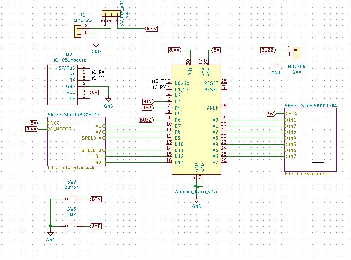

# Sch_LF
Getting started easier in basic robotic for primary and high school. This is a gift from KhalifNovation. Thank you for your support

## HARDWARE

|Hardware|Arduino Pin |Code Label |I/O   |
|--------|:----------:|:---------|:----|
|BUZZER  |D6          |BUZZ       |OUTPUT|
|A1      |D7          |DIR_A1     |OUTPUT|
|A2      |D8          |DIR_A2     |OUTPUT|
|SPEED_A |D9          |SPEED_A1   |OUTPUT|
|B1      |D12         |DIR_B1     |OUTPUT|
|B2      |D13         |DIR_B2     |OUTPUT|
|SPEED_B |D11         |DIR_SPEED  |OUTPUT|
|BUTTON  |D3          |BTN        |INPUT|
|JUMPER  |D4          |JMP        |INPUT|
|IR_SENSOR0|A0          |LS_0        |INPUT|
|IR_SENSOR1|A1          |LS_1       |INPUT|
|IR_SENSOR2|A2          |LS_3       |INPUT|
|IR_SENSOR3|A3          |LS_4       |INPUT|
|IR_SENSOR4|A4          |LS_5       |INPUT|
|IR_SENSOR5|A5          |LS_6       |INPUT|
|IR_SENSOR6|A6          |LS_7       |INPUT|

### Schematic

